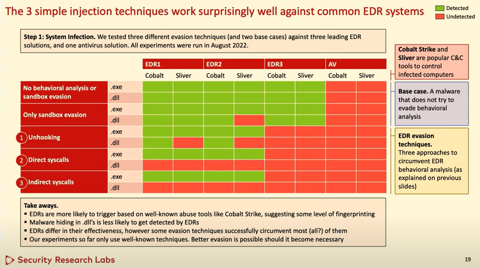

# EDR Bypasses
EDR places hooks in certain moment of execution in memory of processes (after loading DLLs).   
There are different methods / techniques to evade those EDR hooks.   

## Technique 1: Unhooking EDR with clean DLL
Two methods:   
 a) Overwrite DLL in memory with original DLL (e.g. by reading from disk)   
 b) Start process which loads ntdll.dll in suspended state and copy from there   

Note: Accessing ntdll.dll from disk is considered malicious and often flagged by EDR!

## Technique 2: Avoiding EDR hooks with direct kernel system calls
 - Implement your own syscall in an assembly
 - Call the syscall directly (instead of through dll) so you bypass the EDR hook

For this we need the System Service Number (SSN) which identifies the syscall. The SSN vary between different Windows versions.   
The number can be however obtained dynamically, e.g. automated with [SysWhispers2](https://github.com/jthuraisamy/SysWhispers2).
There is also another project by Porchetta Industries, [SysWhispers3](https://github.com/klezVirus/SysWhispers3), which adds x86 support and other stuff.

Note: Having syscall assembly instructions compiled into an executable can trigger static analysis! Also, only the loader will evade the EDR, following actions by the C2 malware might still use hooked functions.

## Technique 3: Indirect system calls
Prepare syscall in assembly but use it via another syscall instruction in ntdll.dll and jump to that location (The ntdll.dll will be the one calling the prepared syscall).

## Comparison (by Security Research Labs)
Some comparison done by [Security Research Labs](https://www.srlabs.de/) as presented in the "Hack In The Box Security Conference" in Singapore 2022:   
   
Source: [YouTube](https://www.youtube.com/watch?v=CKfjLnEMfvI)   

# Notes
- Avoid built-in 'execute-assembly'
- Use InlineExecute-Assembly: https://github.com/anthemtotheego/InlineExecute-Assembly 
