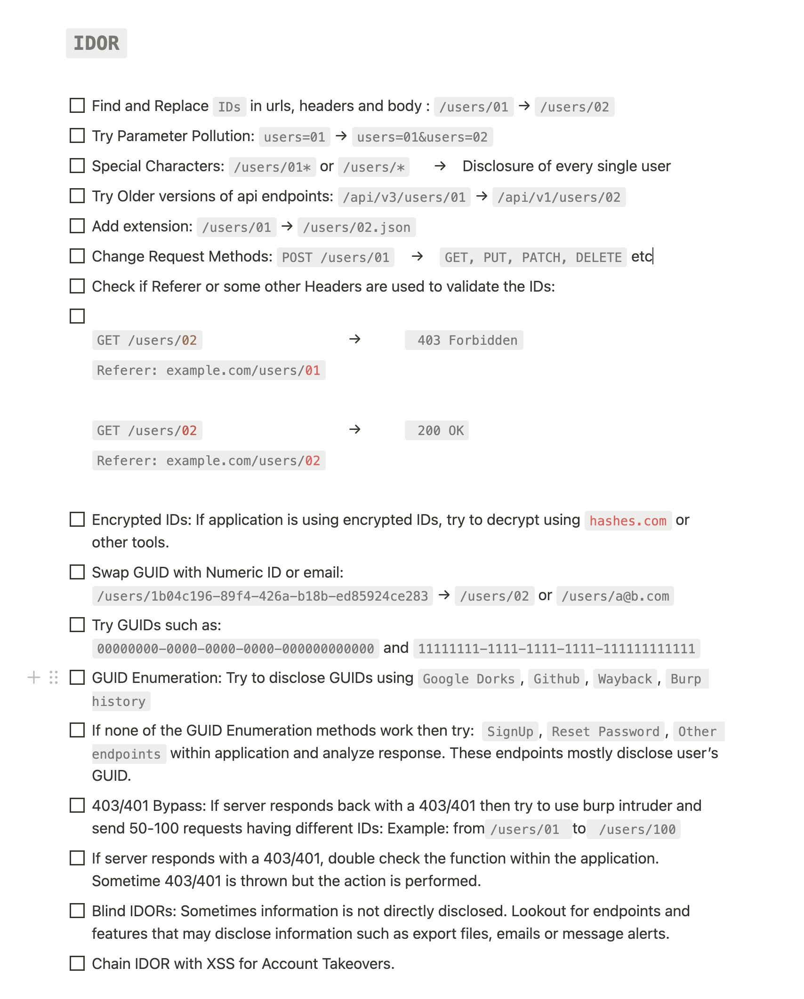

# All Stuff Web App Testing

## Burp

### JRE Apps
Start JRE app with burp as proxy:   
`-Dhttp.proxyHost=127.0.0.1 -Dhttp.proxyPort=8080 -Dhttps.proxyHost=127.0.0.1 -Dhttps.proxyPort=8080`   
Add Burp Cert to CA store:   
`keytool.exe -import -keystore .\lib\security\cacerts -storepass changeit -alias Burp -file .\burp.der`   
To figure out the password of the integrated trust store, download jadx-gui and check the JAR file for a variable like Djavax.net.ssl.trustStorePassword.   

Start with own trust store:   
`-Djavax.net.ssl.trustStore="C:\compass\truststore" -Djavax.net.ssl.trustStorePassword="changeit"`   

## Decrypting Chrome/Firefox HTTPS Traffic in Wireshark

You can decrypt HTTPS traffic from Chrome / Firefox in Wireshark:   
1. Create an environment variable "SSLKEYLOGFILE" and set it to e.g. c:\users\bob\Desktop\sslkeylog.log
2. Restart the browser
3. Start Wireshark and go to Edit → Preferences → Protocols → TLS and set the "(Pre)-Master-Secret log filename" to the path from step 1
4. Restart Wireshark (after setting the environment variable) and you should see the traffic decrypted

## APIs / JSON

### Swagger Files

Get a list of all API endpoints (pathes) in the browser console with JavaScript:   
`let paths = ui.specSelectors.specJson().get("paths")`   
`paths.mapKeys(key => console.log(key))`   

With PowerShell from a swagger file:   
`$apispec = Get-Content .\swagger2.json | ConvertFrom-Json`   
`$apispec.paths`   

## IDOR Checklist

## Cache Control
Check if responses without no-store exist by using the following RegEx in Burps search tool:   
`Cache-Control: (?!.*no-store).*`   