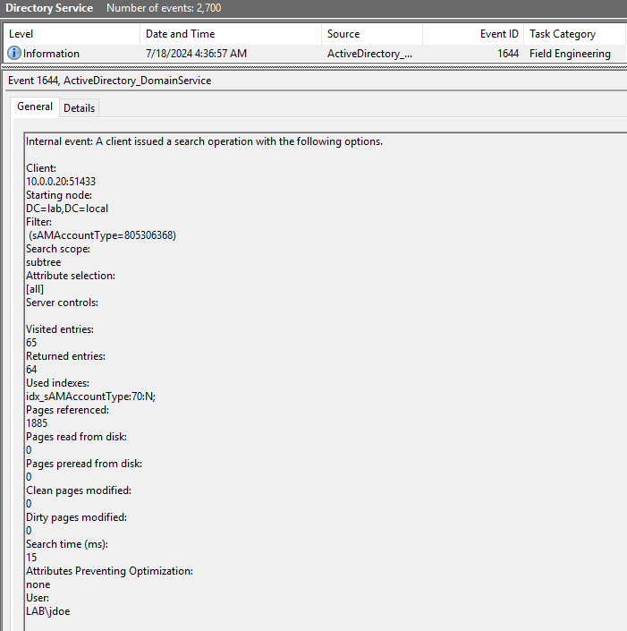

# LDAP Debugging
For debugging it is possible to increase the threshold for LDAP queries which are logged on the DCs Directory Service log.   
To do this change the following registry values (This does not require a reboot):   
```
HKEY_LOCAL_MACHINE\System\CurrentControlSet\Services\NTDS\Diagnostics\15 Field Engineering -> DWORD 5
HKEY_LOCAL_MACHINE\SYSTEM\CurrentControlSet\Services\NTDS\Parameters\Expensive Search Results Threshold -> DWORD 100
HKEY_LOCAL_MACHINE\SYSTEM\CurrentControlSet\Services\NTDS\Parameters\Inefficient Search Results Threshold -> DWORD 100
```
Note: This might cause a lot of events in the log and should not be done for longer timeframes in larger environments!   
Once implemented, check for EventID 1644 in the DCs Directory Service log.   
Example:   
